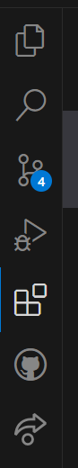

# SE-Assignment-5
Installation and Navigation of Visual Studio Code (VS Code)
 Instructions:
Answer the following questions based on your understanding of the installation and navigation of Visual Studio Code (VS Code). Provide detailed explanations and examples where appropriate.

 Questions:

1. Installation of VS Code:
   - Describe the steps to download and install Visual Studio Code on Windows 11 operating system. Include any prerequisites that might be needed.
open your preffered browser and type this link https://code.visualstudio.com/ and download the visual studio code
locate the downloaded visual studio code file from the downloads and double click on it
when the welcome screen opens, click on next
read the license agreement and click on 'I accept' and click on 'next'
select additional tasks and click on next
wait for installation to be done and click on finish to exit the setup wizard

2. First-time Setup:
   - After installing VS Code, what initial configurations and settings should be adjusted for an optimal coding environment? Mention any important settings or extensions.
   you can change the theme color and font size
   extensions to download include the language you are intending to use for coding like python. you click on explore, and search python and thn download it

other extensions include dart and flutter
3. User Interface Overview:
   - Explain the main components of the VS Code user interface. Identify and describe the purpose of the Activity Bar, Side Bar, Editor Group, and Status Bar.
the activity bar is found at th left side of the VS Code window. it provides quick access to features and extensions

side bar is located to the right of activity bar and it cointains contents that are related to the selected activity bar item.

editor group is found at the central of VS Code window and it allows editing of files

status bar is found at the bottom of VS Code window, it shows information on current state of editor and the active files

4. Command Palette:
   - What is the Command Palette in VS Code, and how can it be accessed? Provide examples of common tasks that can be performed using the Command Palette.
   Command palette allows one to quickly access a wide range of commands within the editor. it can be accessed by clicking on view menu and selecting command palette
it allows for installation and disabling of extensions, one can debug from the command palette and formatting a document
5. Extensions in VS Code:
   - Discuss the role of extensions in VS Code. How can users find, install, and manage extensions? Provide examples of essential extensions for web development.
   Extensions enhances and customizes the functionality of the editor. they provide language support, code formatting, version control intergration.
   essential extensions for web development include but not limited to;
   prettier- formats code to be readable and consistent
   React
   GitLens that enhances Git capabilities from VS Code
   to install an extension, open extensions view and search for the extension you need, then click in install button 

6. Integrated Terminal:
   - Describe how to open and use the integrated terminal in VS Code. What are the advantages of using the integrated terminal compared to an external terminal?
   to open an intergrated terminal in VS Code click on view and then select terminal
   
the advantage of using an intergrated terminal in VS Code is that it creates a convinience since it allows one to be in the same application for coding and terminal operations, it makes it easier to run project specific commands as it opens in the context of the project directory and one is able to multi-task by opening multiple terminal instances and splitting the terminal view
7. File and Folder Management:
   - Explain how to create, open, and manage files and folders in VS Code. How can users navigate between different files and directories efficiently?
   To create a file, right click on explorr and select new file, type the name of the new file and click enter
   To create a folder, right click on explorer and select new folder, type the name of the new folder and click enter
   To open a folder, go to file, then select open folder and choose the folder you want by selecting it
   to open a file, double click on file in the explorer to open it in the editor
   to re-name a file or folder, right click on the file or folder in the explorer and select rename, type in the new name and press enter
   to move a file or folder, drag and drop to desired location in the explorer
   to delet a file or folder, right click on it and select delete
   you can use arrow keys to navigate files and folders in the explorer and press enter to open selected file or folder

8. Settings and Preferences:
   - Where can users find and customize settings in VS Code? Provide examples of how to change the theme, font size, and keybindings. 
   to access settings, click on file, then click preferences then select settings
   to change theme, type theme in the search bar after opening settings. This will allow you make any chamges you want on the theme

   
   for font size, just type font size in the sarch bar in settings, this will allow you to make the necessary changes on the font size
   
   to change keybindings, click on file, then preferences then choose keyboard shortcuts, this will allow you change keybindings to however you want
   

9. Debugging in VS Code:
   - Outline the steps to set up and start debugging a simple program in VS Code. What are some key debugging features available in VS Code?
   open VS Code and go to file, open folder and select your project folder
   make sure you have installes python extension in your VS Code
   In the explorer, right click and select new file, name the file and make sure the name edds with .py
   then open the file and write your code in the file
   click on run and debug icon on the activity bar

10. Using Source Control:
    - How can users integrate Git with VS Code for version control? Describe the process of initializing a repository, making commits, and pushing changes to GitHub.
    open your project folder in VS Code
    open the source control view by clicking the source control icon on the side of the window 
    click on intialize repository to crate a new Git repository in your project folder

 Submission Guidelines:
- Your answers should be well-structured, concise, and to the point.
- Provide screenshots or step-by-step instructions where applicable.
- Cite any references or sources you use in your answers.
- Submit your completed assignment by 1st July 

